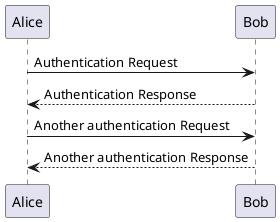

---

# Contexte
---

 

---
# Taux de réussite

---

  # Besoin client
 

---

# Usage

---
 # Temps

---
 # Coût de la qualité
 

---
  # Evolution de la performance
 

---
 # Cas d'utilisation

---

 # Raisons de la faible qualité des logiciels
* Tâche complexe
* Manque de méthodes et de rigueur
* Mauvaise compréhension des besoins

---
 # Critères de qualité
* Validité : réponse aux besoins des utilisateurs
* **Maintenabilité** : facilité à corriger ou transformer le logiciel
* Performance : temps de réponse, débit, fluidité...

**hardware vs software**

---
# Different niveaux de conceptions

* Organisation de l'entreprise
* Architectures logiciel (Stratégie)
* Schéma de conception (Tactique)
* Algorithmique

---
 # Organisation de l'entreprise

**Loi de conway**:
 _les organisations créent des systèmes à l’image de leurs propres structures de communication_

---
 # Architectures logiciel

* Communication entre les systèmes
    * API
    * Queue
    * ...
* Architecture des systèmes
    * NTiers
    * Hexagonal
    * ...

---
# Schéma de conception

 * Principes de conception orientée objet
    * SOLID
    * Design pattern

