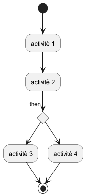
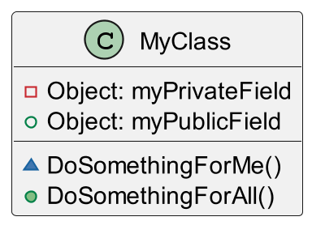
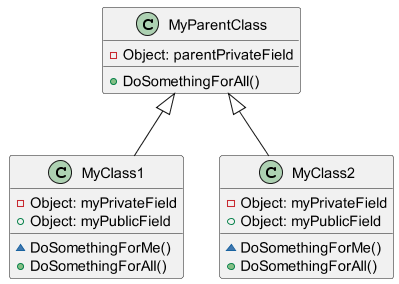
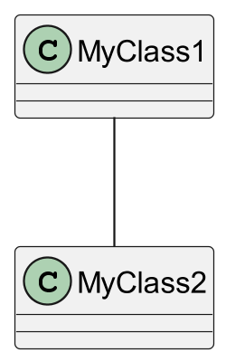
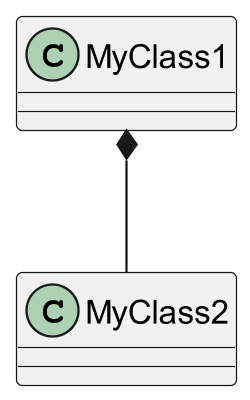
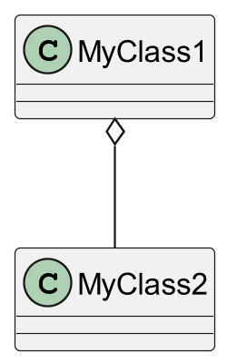
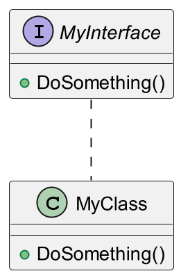

---
marp: true
theme: gaia
class:
    - lead
    - invert
 ---
 # UML
 _Unified Modeling Language_

 ---
 # Quoi
* Langage
  * Syntaxe
  * Normalisées
* Modélisation
  * Abstraction du fonctionnement
  * Spécification et conception
* Unifié
  * Standard

 ---
# Pourquoi
* Analyser
* Documenter
* Apprendre

 ---
# Differents diagrammes
|Diagrammes structurels|Diagrammes comportementaux|Diagrammes d'interaction|
| :--------------- |:---------------:| -----:|
|**Diagramme de classes**|**Diagramme de cas d'utilisation**|**Diagramme de séquence**|
| Diagramme d'objets|Diagramme états-transitions|Diagramme de communication|
| Diagramme de composants|Diagramme d'activité|Diagramme global d'interaction|
|Diagramme de déploiement|||

 ---
 # Cas d'utilisation


 ---
 # Activités


 ---
 # Classes: class

```
public class MyClass() { }
```

 ---
 # Classes: Extension

```
public class MyClass1() extends MyParentClass{ }
```

 ---
 # Classes: Relation
 
```
public class MyClass1(){
    public void doSomething(){ myClass2.doSomething(); }
}
```

 ---
 # Classes: Composition
 
 ```
public class MyClass1(){
    public MyClass1() { this.myClass2 = new MyClass2(); }
}
 ```

 ---
 # Classes: Agregation
 
 ```
public class MyClass1(){
    public MyClass1(MyClass2 myClass2) { this.myClass2 = myClass2; }
}
 ```

 ---
 # Classes: Interface
 
 ```
public class MyClass1() implements MyClass2{ }
 ```

 ---
 # Séquence
 

 ---
 # Ressources

 * [UML](https://www.lucidchart.com/pages/fr/langage-uml#:~:text=Le%20langage%20UML%20(Unified%20Modeling,et%20riche%20s%C3%A9mantiquement%20et%20syntaxiquement))
 * [Modélisation UML de Christine Solnon](https://perso.liris.cnrs.fr/christine.solnon/coursUML.pdf)
 * [Introduction au génie logiciel
et à la modélisation de
Delphine Longuet](https://www.lri.fr/~longuet/Enseignements/17-18/Et3-UML/)