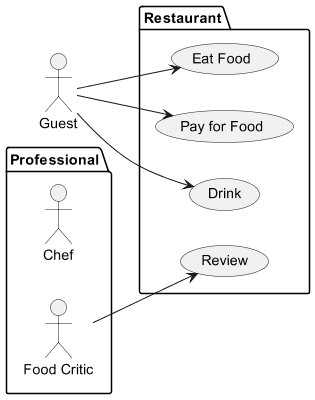
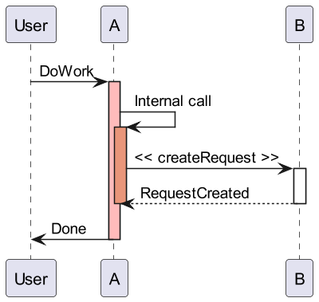

---
marp: true
theme: gaia
class:
    - lead
    - invert
 ---
  # Réactivation des connaissances

 ---
# C'est quoi la modélisation de systèmes ?

  * Des dessins en 3D ou 2D qui passent à la TV
  * Des schémas qui illustrent un logiciel
  * Des outils pour présenter des idées
  * De la documentation

  ---

  # C'est quoi la modélisation de systèmes ?

  * Des dessins en 3D ou 2D qui passent à la TV
  * __Des schémas qui illustrent un logiciel__
  * __Des outils pour présenter des idées__
  * __De la documentation__

 ---
  # Pourquoi modéliser ?

  * Dessiner
  * Analyser
  * Documenter
  * Apprendre

 ---
  # Pourquoi modéliser ?

  * Dessiner
  * __Analyser__
  * __Documenter__
  * __Apprendre__

 ---
  # Comment modéliser ?

  * En utilisant des outils tel qu'UML
  * En faisant des dessins
  * En écrivant de la documentation
  * En faisant des réunions

 ---
  # Comment modéliser ?

  * __En utilisant des outils tel qu'UML__
  * __En faisant des dessins__
  * En écrivant de la documentation
  * En faisant des réunions

 ---
  # C'est quoi UML ?

  * Un langage
  * Un logiciel
  * Une méthode
  * Un dessin

 ---
  # C'est quoi UML ?

  * __Un langage__
  * Un logiciel
  * Une méthode
  * Un dessin

   ---
  # Combien existe t il de types de diagrammes en UML 2.4 ?

  * 3
  * 8
  * 14
  * 30

   ---
  # Combien existe t il de types de diagrammes en UML 2.4 ?

  * 3
  * 8
  * __14__
  * 30

   ---
  # Quels diagrammes avons nous vue la dernière fois

  * Diagrammes de classes
  * Diagrammes de cas d'utilisation
  * Diagramme de cycle de vie
  * Diagrammes de séquences

   ---
  # Quels diagrammes avons nous vue la dernière fois

  * __Diagrammes de classes__
  * __Diagrammes de cas d'utilisation__
  * Diagramme de cycle de vie
  * __Diagrammes de séquences__

   ---
  # Quel est ce diagramme ?

 ---
  # Quel est l'usage d'un diagramme de classes ?

  * Présenter le fonctionnement d'un système
  * Visualiser les classes d'un système ainsi que les relations entre elles
  * Documenter un système
  * Expliquer au client le fonctionnement du produit

 ---
  # Quel est l'usage d'un diagramme de classes ?

  * Présenter le fonctionnement d'un système
  * __Visualiser les classes d'un système ainsi que les relations entre elles__
  * __Documenter un système__
  * Expliquer au client le fonctionnement du produit
   ---
  # Quel est ce diagramme ?

 ---
  # Quel est l'usage d'un diagramme de séquence ?

  * Présenter le fonctionnement d'un système
  * Visualiser les classes d'un système ainsi que les relations entre elles
  * Documenter un système
  * Expliquer au client le fonctionnement du produit

 ---
  # Quel est l'usage d'un diagramme de séquence ?

  * __Présenter le fonctionnement d'un système__
  * __Visualiser les classes d'un système ainsi que les relations entre elles__
  * __Documenter un système__
  * Expliquer au client le fonctionnement du produit