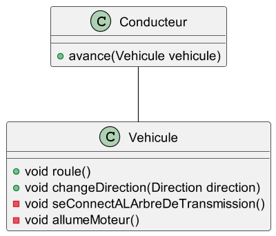
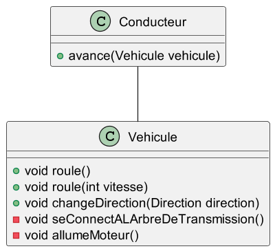
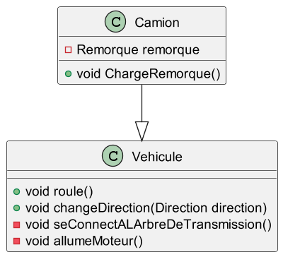
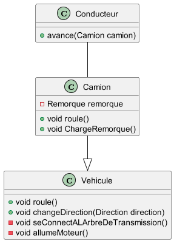
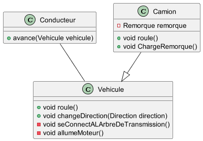
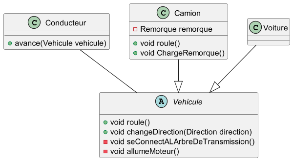
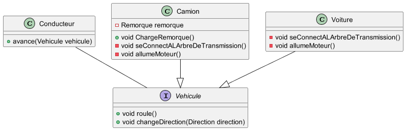
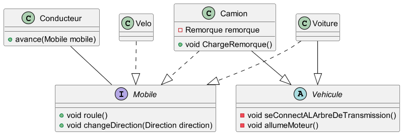

---
marp: true
theme: gaia
class:
    - lead
    - invert
 ---
 Programmation Orienté Objet

 ---

Classe, un patron pour creer des objets

 ---
 Classe

 * Constructeur -> Comment mon patron va creer une instance de classe (un objet)
 * Propriétés -> Les composants de l'objet
 * Méthode -> Les comportements de l'objet

 ---
 Classe et objets

Une classe __definie__ un contexte, un comportement interne.
Un objet __implemente__ un contexte, un comportement interne.

 ---
Encapsulation

Classes et objets peuvent exposer une partie de leurs contextes ou de leurs comportements pour communiquer avec l'exterieur

```
class conducteur{
    void avance(Vehicule vehicule){ vehicule.roule(); }
}
```

 ---
Surchage

Un objet peut surcharger un comportement


```
class conducteur{
    void avance(Vehicule vehicule){ vehicule.roule(50); }
}
```

 ---
 Héritage

Un objet peut être spécialisé, étendu grâce à de l'heritage



```
class Camion extends Vehicule { }
```

 ---
Redéfinition

Un objet spécialisé peut rédefinir un comportement ou un contexte



```
class conducteur {
     // même nom de methode que vehicule.roule mais cette fois-ci la vitesse est limitée à 110km/h dans le code de la methode camion.roule
    void avance(Camion camion){ camion.roule(); }
}
```

 ---
Polymorphisme

Un objet peut être vue comme une classe de sa hierarchie



```
conducteur.avance(new Camion());
class conducteur {
    // vehicule est ici un camion
    void avance(Vehicule vehicule){ vehicule.roule(); }
}
```
 ---
 Classe abstraite

Patron d'objet qui ne peut pas être instancié



```
new Camion()   //OK
new Voiture()  //OK
new Vehicule() //KO
```

 ---
 Interface

 Definition d'un contrat


 ---
 Interface

 Definition d'un contrat


 ---
 Sources

 https://www.technologuepro.com/cours-informatique/cours-15-programmation-orientee-objets-poo/