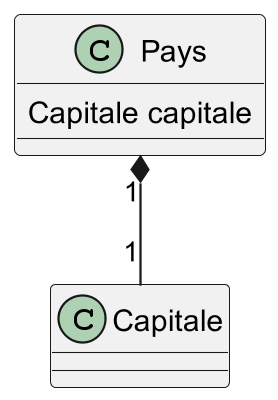
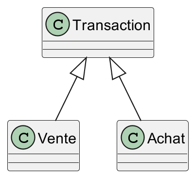
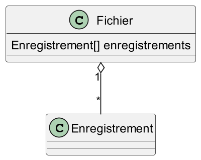
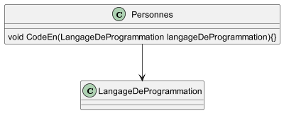
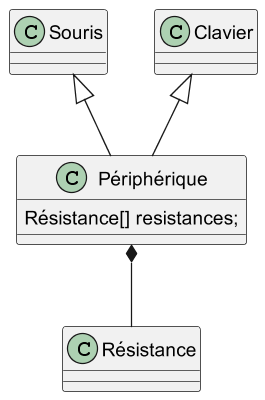
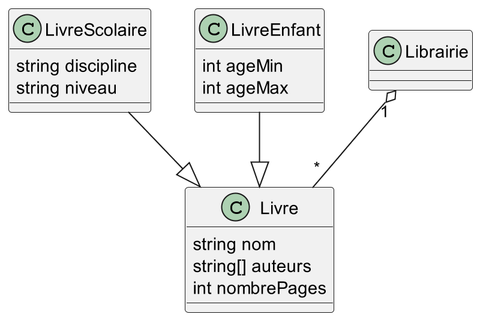
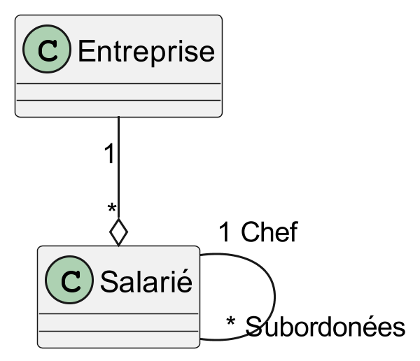
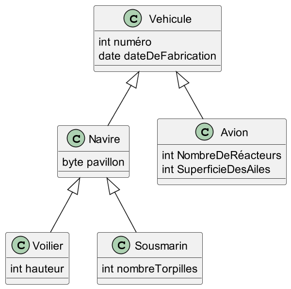
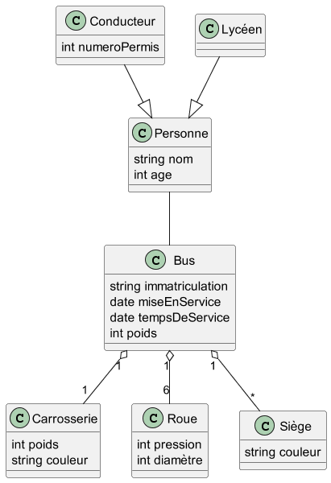

---
marp: true
theme: gaia
class:
    - lead
    - invert
 ---
Exercices: Diagrammes de classes
Pour chaque exemple ci-dessous, indiquez si la relation présentée est une spécialisation, une agrégation, une composition ou une association :
1. __Un pays a une capitale__

 ---
Diagrammes de classes: Un pays a une capitale
=> __Composition__


```
class Pays(){
  public capitale;
  public Pays(){ this.capitale = new Capitale(); }
}
```

 ---
 Exercices: Diagrammes de classes
Pour chaque exemple ci-dessous, indiquez si la relation présentée est une spécialisation, une agrégation, une composition ou une association :
1. Un pays a une capitale
2. __Une transaction boursière est un achat ou une vente__

  ---
Diagrammes de classes: Une transaction boursière est un achat ou une vente
=> __Spécialisation__


```
class Transaction() { }
class Achat() extends Transaction { }
class Vente() extends Transaction { }
```

 ---
 Exercices: Diagrammes de classes
Pour chaque exemple ci-dessous, indiquez si la relation présentée est une généralisation, une agrégation ou une association :
1. Un pays a une capitale
2. Une transaction boursière est un achat ou une vente
3. __Les fichiers contiennent des enregistrements__

  ---
Diagrammes de classes: Les fichiers contiennent des enregistrements
=> __Agregation__


```
class Enregistrement() { }
class Fichier(){
  public Enregistrement[] enregistrements;
  public Fichier(Enregistrement[] enregistrements){}
}
```

 ---
 Exercices: Diagrammes de classes
Pour chaque exemple ci-dessous, indiquez si la relation présentée est une spécialisation, une agrégation, une composition ou une association :
1. Un pays a une capitale
2. Une transaction boursière est un achat ou une vente
3. Les fichiers contiennent des enregistrements
4. __Une personne utilise un langage de programmation dans un projet__

  ---
Diagrammes de classes: Une personne utilise un langage de programmation dans un projet
=> __Association__


```
class LangageDeProgrammation() { }
class Personne(){
  public CodeEn(LangageDeProgrammation langageDeProgrammation){}
}
```

 ---
 Exercices: Diagrammes de classes
Pour chaque exemple ci-dessous, indiquez si la relation présentée est une spécialisation, une agrégation, une composition ou une association :
1. Un pays a une capitale
2. Une transaction boursière est un achat ou une vente
3. Les fichiers contiennent des enregistrements
4. Une personne utilise un langage de programmation dans un projet
5. __Les souris et les claviers sont des périphériques qui ont des résistances__

  ---
Diagrammes de classes: Les souris et les claviers sont des périphériques qui ont des résistances
=> __Spécialisation__ + __Composition__


```
class Périphérique() {
  public Périphérique () { this.resistances.Add(new Résistance(),new Résistance(),new Résistance())}
}
class Souris() extends Périphérique {}
class Clavier() extends Périphérique {}
```

 ---
Exercices: Diagrammes de classes

- Une librairie vend des livres caractérisés par:
  * un nom
  * un ou des auteurs
  * un nombre de pages
- Certains livres possèdent également d’autres caractéristiques comme :
  * une fourchette des âges pour les livres pour enfants
  * une discipline et le niveau pour les livres scolaires

 ---
Exercices: Diagrammes de classes



 ---
Exercices: Diagrammes de classes

Une entreprise est constitué de salariés où des subordonnées sont sous la direction d'un chef, lui même salarié et sous la direction d'un chef.

 ---
Exercices: Diagrammes de classes



 ---
Exercices: Diagrammes de classes

Une classe Véhicule a été caractérisée par les propriétés suivantes :
* Numéro du véhicule
* Date de fabrication
* Pavillon du bateau
* Nombre de réacteurs
* Superficie des ailes
* Hauteur du mat
* Nombre de torpilles.
Quel est le défaut de cette classe ? Proposez une autre représentation.

 ---
Exercices: Diagrammes de classes



 ---
Exercices: Diagrammes de classes

* Dans une société de transport, on voudrait gérer les bus de ramassage scolaire et les conducteurs.
* Un lycéen est un enfant, il est caractérisé par son nom et son âge
* Les informations qui caractérisent le conducteur sont les mêmes que pour le lycéen, avec en plus le numéro de son permis.
* Quant au bus, on a besoin de connaître son numéro d’immatriculation, sa date de mise en service, nombre d’années de service, et le poids total. De plus, un bus est composé d’une carrosserie (poids, couleur), de 6 roues (pression, diamètre), de plusieurs sièges (couleur) pour passagers).

 ---
Exercices: Diagrammes de classes



 ---
Exercices: Diagrammes de classes

 Un utilisateur souhaite se faire un café expresso. Il souhaiterait pouvoir configuer l'intensité de son café ainsi que choisir entre en un café court et un café long. La maintenance de la machine, la quantité d'eau et de grain de café, état du réservoir de marc à café est à la charge de l'utilisateur.

  ---
Exercices: Diagrammes de classes

L'utilisateur souhaiterait ne pas à avoir à configurer la machine à chaque fois qu'il l'utilise et souhaiterait donc enregister ses preferences. La machine peut être utilisé par plusieurs personnes.