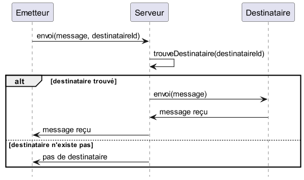

---
marp: true
theme: gaia
class:
    - lead
    - invert
 ---
Exercices: Diagrammes de séquences

Un **Emetteur** _envoie_ un _message_ à un **Destinataire**

 ---
Exercices: Diagrammes de séquences

Un **Emetteur** _envoie_ un _message_ à un **Destinataire**

 ---
Exercices: Diagrammes de séquences

L'_envoi_ de l'**Emetteur** doit passer par un **Serveur** pour _selectionner_ le **Destinataire**. L'_envoi_ connait le _message_ ainsi que l'_id_ du **Destinataire**.

 ---
Exercices: Diagrammes de séquences

L'_envoi_ de l'**Emetteur** doit passer par un **Serveur** pour _selectionner_ le **Destinataire**. L'_envoi_ connait le _message_ ainsi que l'_id_ du **Destinataire**.

 ---
Exercices: Diagrammes de séquences

L'**Emetteur** est informé quand le _message_ est reçu ainsi que lorsque le **Destinataire** n'existe pas

 ---
Exercices: Diagrammes de séquences

L'**Emetteur** est informé quand le _message_ est reçu ainsi que lorsque le **Destinataire** n'existe pas

 ---
Exercices: Diagrammes de séquences

Il peut arriver que le **Destinataire** ne reçoit pas le _message_ même si ce dernier a été envoyé par le serveur. Dans ce cas, le serveur renvoie le message jusqu'à ce qu'il soit délivré ou dans la limite de 10 tentatives.

 ---
Exercices: Diagrammes de séquences

Il peut arriver que le **Destinataire** ne reçoit pas le _message_ même si ce dernier a été envoyé par le serveur. Dans ce cas, le serveur renvoie le message jusqu'à ce qu'il soit délivré ou dans la limite de 10 tentatives.

 ---
Exercices: Diagrammes de séquences

A partir du diagramme d'activité et du diagramme de classe de la machine à café, réalisez le diagramme de séquence du scénario où il n'y a pas de problèmes

 ---
Exercices: Diagrammes de séquences

* Comment gérer tous les cas ?
* Le diagramme est il le même si les appels sont asynchrones ?
