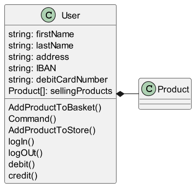

---

marp: true
theme: gaia
class:
    - lead
    - invert
 ---

# Exercice de principe de programmation Orienté Objet

 ---

# Single responsability principle (SRP)

 Une classe ne devrait avoir qu’une seule raison de changer.

* Pourquoi cette implementation ne respecte pas SRP ?
* Comment la corriger ?

 ---

# Single responsability principle (SRP)

 ---

# Open close principle (OCP)

 Les entités d’un logiciel devraient être fermées aux modifications mais ouvertes à l’extension.

* Comment gérer l'age de vente d'alcool pour la France et les US ?

 ---

# Open close principle (OCP)

 ---

# Liskov principle (LSP)

Un programme ne doit pas dépendre de l'implementation de ces abstractions
 

* Pourquoi cette implementation ne respecte pas LSP ?
* Comment la corriger ?

 ---

# Liskov principle (LSP)

 

  ---

# Interface segregation principle (ISP)

L’appelant ne devrait pas connaître les méthodes qu’il n’a pas à utiliser.

 

* Pourquoi cette implementation ne respecte pas ISP
* Comment la corriger ?

 ---

# Interface segregation principle (ISP)

   

  ---

# Dependency inversion principle (DIP)

Les modules d’une application devraient dépendre d’abstractions.

 

* Pourquoi cette implementation ne respecte pas DIP
* Comment la corriger ?

 ---

# Dependency inversion principle (DIP)

 

 ---

# Sources

* <http://blog.ezoqc.com/5-exemples-faciles-pour-comprendre-les-principes-solid/>
