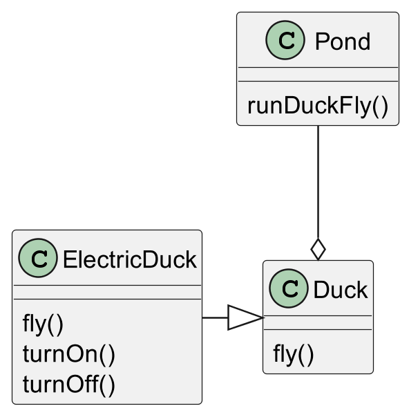
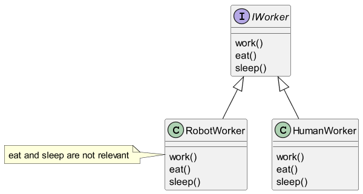
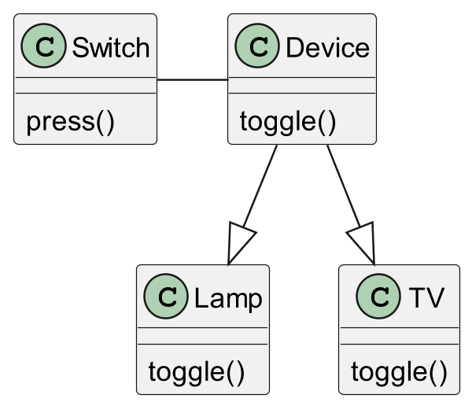

---
marp: true
theme: gaia
class:
    - lead
    - invert
 ---
# Principe de programmation Orienté Objet

 ---
# Don't repeat yourself (DRY)

* Dans un système, toute connaissance doit avoir une représentation unique,  non-ambiguë, faisant autorité.
* Tout développeur devrait être payé à la ligne de code qu'il nécrit pas.

 ---
# Keett it simple stupid (KISS)

* Un programme simple estt plus facile à maintenir et à comprendre
* Il est difficile de faire simple

 ---
# You ain't gonna need it (YAGNI)

* Mettre en ouvre le choses que nous avons effectivement besoin et non pas les choses que nous prévoyons avoir besoin.

 ---
# SOLID

* **S**ingle responsability principle (SRP)
* **O**pen close principle (OCP)
* **L**iskov principle (LSP)
* **I**nterface segragation principle (ISP)
* **D**ependency invertion principle (DIP)

 ---
 # Single responsability principle (SRP)

 * Chaque module d'un systeme ne devrait avoir qu'une seule raison de changer
 * /!\ Penser à la source de la demande de changement, les gens.

 ---
 # Open close principle (OCP)

 * Le comportement d'un systeme doit pouvoir être étendu sans changer ce système

 ---
 # Open close principle (OCP)

 ---
 # Liskov principle (LSP)

* Un programme ne doit pas dépendre de l'implementation de ces abstractions

 ---
 # Liskov principle (LSP)

 ---
 # Liskov principle (LSP)

 ---
 # Interface segragation principle (ISP)

* Les interfaces doivent rester petites pour ne pas dépendre d'éléments non necessaires.
* L’appelant ne devrait pas connaître les méthodes qu’il n’a pas à utiliser

 ---
 # Interface segragation principle (ISP)

 ---
 # Dependency invertion principle (DIP)

* Les modules de haut niveau ne devraient pas dépendre des details des modules de bas niveaux.

 ---
 # Dependency invertion principle (DIP)

 ---
 # Dependency invertion principle (DIP)

 ---
 # Sources

 * The Pragmatic Programmer
 * Extreme Programming Explained
